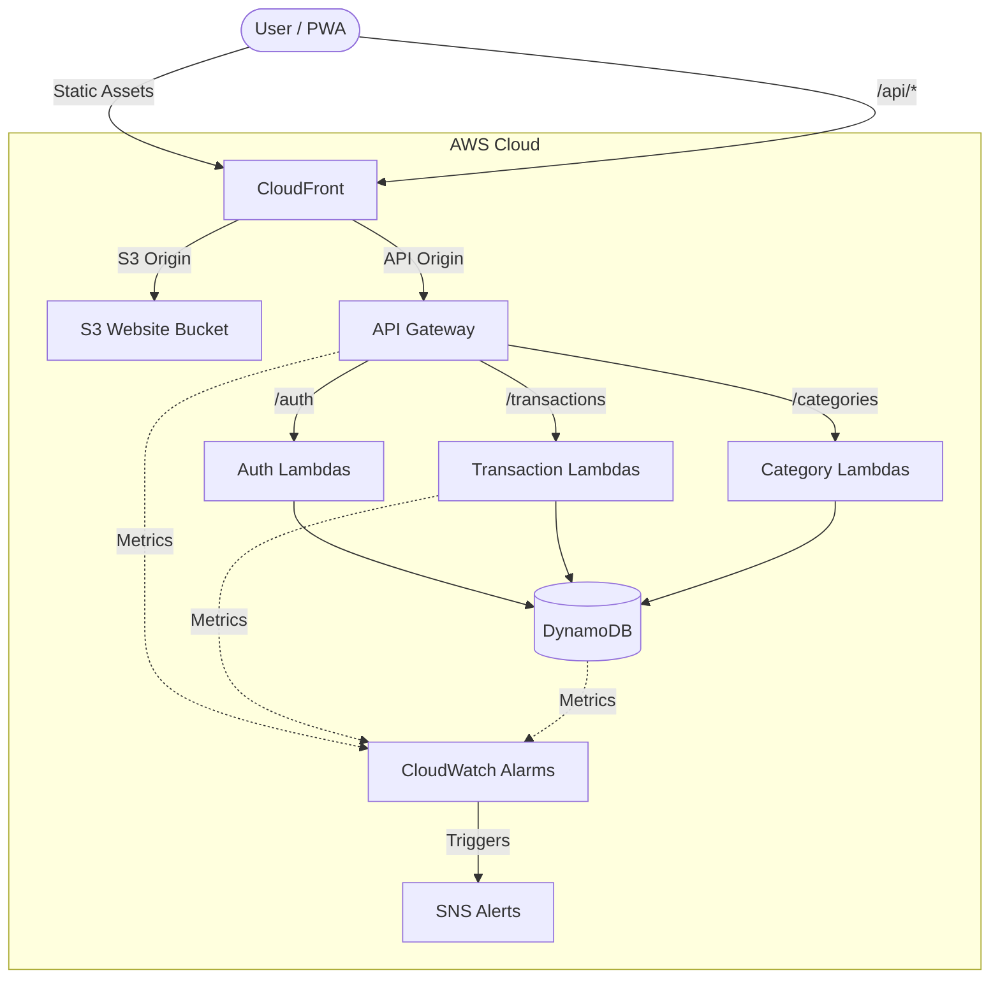

# PocketLog - Architecture & Low-Level Details

This document outlines the complete architectural design and low-level implementation details of the PocketLog application.

## 🏗️ Architecture Diagram

## 🌐 1. Edge & Routing Infrastructure (CloudFront)

The entry point for all traffic is a unified **Amazon CloudFront Distribution**. This offers CDN caching for static assets while seamlessly routing API calls to the backend under a single domain.

- **Default Behavior (`/*`)**: Routes to an **S3 Bucket** configured with Origin Access Control (OAC). S3 is blocked from public access, ensuring it can only be accessed via CloudFront.
- **API Behavior (`/api/*`)**: Routes to the **HTTP API Gateway**.
  - **Caching:** Disabled.
  - **Origin Request Policy:** `ALL_VIEWER_EXCEPT_HOST_HEADER` — This passes cookies (essential for auth), query strings, and standard headers to the API Gateway.
  - **Why?** It completely mitigates Cross-Origin Resource Sharing (CORS) complexities and allows the secure application of `SameSite=Strict` cookies.

## 🖥️ 2. Frontend Application (React + Vite + PWA)

The client is a Progressive Web App (PWA) built for a native-like experience on mobile and desktop.

- **Framework**: React 18 with TypeScript, bundled using Vite.
- **Styling**: Tailwind CSS, supporting dynamic Light/Dark themes via `ThemeContext`.
- **Offline & Caching**: Powered by `vite-plugin-pwa`, it registers a Service Worker that caches static assets (`index.html`, JS bundles, CSS, icons) so the app loads instantly, even offline.
- **API Communication**: The `api.ts` utility encapsulates all `fetch` requests to `/api/*`, automatically injecting `credentials: "include"` so the browser attaches the secure `HttpOnly` cookie.
- **State Management**:
  - `AuthContext`: Tracks the logged-in user state.
  - `CategoryContext`: Caches the user's categories to avoid redundant network requests across different views (Dashboard, Analysis, etc.).

## ⚙️ 3. Backend API & Compute (API Gateway + AWS Lambda)

The backend is fully Serverless. **Amazon API Gateway (HTTP API v2)** acts as the router, triggering specific **AWS Lambda** functions (Node.js 20.x).

### Lambda Bundling & Performance
- All Lambdas are bundled using `esbuild` via `NodejsFunction` in the CDK. This minifies the code and strips out unused dependencies, resulting in lightning-fast cold starts.

### Security & Authentication Flow
- **Registration & Login**: Uses `bcryptjs` for secure password hashing. Upon successful authentication, a JSON Web Token (JWT) is generated using `jsonwebtoken`.
- **Secure Delivery**: The JWT is returned to the client as an `HttpOnly`, `Secure`, `SameSite=Strict` cookie.
  - *HttpOnly:* Prevents JavaScript access, mitigating XSS attacks.
  - *SameSite=Strict:* Prevents CSRF attacks by ensuring the cookie is only sent for same-site requests.
- **Authorization**: Protected routes use a shared `verifyToken.ts` middleware. It extracts the JWT from `event.cookies`, verifies the signature using the `JWT_SECRET` environment variable, and extracts the user's `mobileNumber` to pass along to the downstream Lambda logic.

## 🗄️ 4. Data Layer (DynamoDB Single-Table Design)

The database utilizes **Amazon DynamoDB** with a highly optimized Single-Table Design. All entities (Users, Transactions, Categories) exist in the same table, `PocketLog-Data`.

### Schema Design
- **Partition Key (PK)**: `USER#<mobileNumber>`
- **Sort Key (SK)**: Entity specific identifier (e.g., `METADATA`, `CAT#<id>`, `TX#<timestamp>`).

### Strict Data Entitlements & Isolation
The application guarantees strict multi-tenant data isolation purely through the data access patterns:
1. The authenticated user's `mobileNumber` is extracted directly from the verified JWT.
2. Every DynamoDB query strictly enforces the Partition Key (`PK = USER#<mobileNumber>`).
3. This creates a hard cryptographic boundary; a user can mathematically only read, write, or delete rows partitioned under their own verified identity.

### Access Patterns
- **User Profile**: `PK = USER#<mobileNumber>`, `SK = METADATA`
- **Categories**: `PK = USER#<mobileNumber>`, `SK begins_with(CAT#)`
- **Transactions**: `PK = USER#<mobileNumber>`, `SK begins_with(TX#)`
  - Queries can retrieve transactions for a specific month by utilizing `begins_with(TX#2026-07)`.

## 📊 5. Observability (CloudWatch & SNS)

To ensure high availability and performance within the AWS Free Tier, the application incorporates **Zero-Cost Observability** using CloudWatch Alarms and SNS.

- **SNS Topic**: `PocketLog-Alerts` - Routes alarms to an email subscriber.
- **API Gateway Alarms**: Monitors for `5XXError` spikes and P95 `Latency` (>2000ms).
- **Lambda Alarms (Transactions)**: Monitors for `Errors` and execution `Duration` spikes.
- **DynamoDB Alarms**: Monitors `SystemErrors` and `ThrottledRequests` to detect capacity issues.
- **CloudFront Alarms**: Tracks global `5xxErrorRate` and `TotalErrorRate` to catch edge delivery failures.
